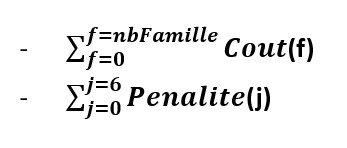
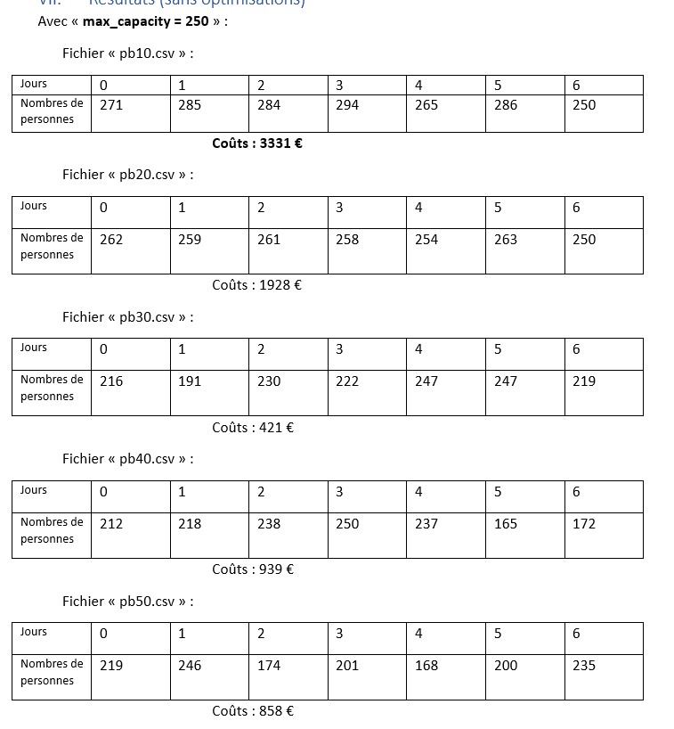
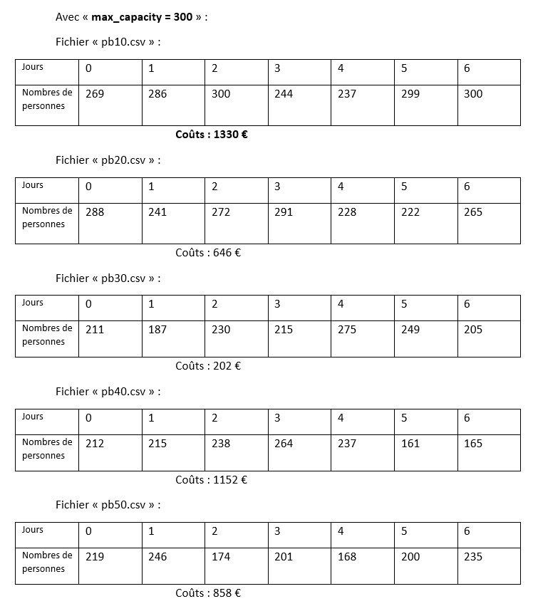

# Project Report: C Programming - Organization of Cultural Days

(spectacles + lunch + concerts)

Author: MU Maxime (IMT Mines Alès / Student)  
Date: 18/03/2023

## Table of Contents
Question 1  
I. Context  
II. Objective  
III. Data  
IV. Principle of resolution  
V. Explanation  
VI. Implementation  
VII. Results (without optimizations)  
VIII. Interpretations  
IX. Algorithm optimizations  
Question 2  

## Question 1

### I. Context
The objective is to plan the assignment of all registered families for a given week while respecting a set of constraints and minimizing a nonlinear cost function. This planning should be done for each day of the week over a period of one week.
### II. Objective
The objective of the organizing company is to reduce to a minimum the sum of the allowances paid to the families and to the mobilized personnel while respecting the constraints imposed.

The function to be minimized is the objective function (economic function) is therefore:

Minimizing the objective function amounts to minimizing the terms in the sum, namely:

### III. Data
We have five *.csv files, a table containing family data, namely the size of the family and their five preferences in order (from 0 to 6).

### IV. Principle of resolution
Each family is assigned to its first preference (number 1) in order of priority as long as there is space available. If a family cannot be assigned to their choice number 1, they will be assigned to their choice number 2 if there is space, and so on until they cannot be assigned to any of their choice. In this case, the family will be affected on the day when participation is lowest. This process helps maximize assignments based on family preferences while avoiding overload on days when there are already a lot of participants.

### V. Explanation
Giving families their priority choices reduces the risk of high payouts because the more less preferred choices are allocated, the greater the payouts. Additionally, by assigning families on the day when attendance is lowest, the time between assignments is reduced, which limits potential penalties and lowers overall costs.

### VI. Implementation
The void “readData” method takes as parameters the name “fileName” of the *.csv file, and a 3D array “families” that we will fill from the file data. This method also gives the number of rows and the number of columns that the "families" table has.
The “assignFamilies” method takes as parameters the number of rows “num_rows”, the number of columns “num_colomns” and the array “families”. This method will assign the families to the days corresponding to their choice. It will call the “indemnity” and “penalty” methods for calculating the costs. It will return the value of the total cost (objective function), namely the sum of the indemnities and penalties.
The “compensation” method takes as parameters the choice of the family “family_choice” and the number of members in this family “number”. It returns an integer corresponding to the allowances due to the family.
The “penality” method takes as parameters the capacity of day n°d “capacityOfToday”, the capacity of day n°d+1 “capacityOfTomorrow” and the current day d. It returns an integer corresponding to the penalties that the company owes to its employees.
The void “showResults” method takes as a parameter an integer “i” corresponding to the position number of the working csv file. The method is to display in the console:
- The name of the table being worked on.
- The number of rows and the number of columns of the table.
- The distribution of families according to the days.
- The total number of people.
- The result of the objective function.
The void “resetData” method consists of erasing all the contents of the global variables in order to work on the following .csv file.

### VII. Results (without optimizations)
The results of the program without any optimizations are:

### VIII. Interpretations
We note that with a capacity of 250, the assignments of the families exceed the maximum capacity and which therefore has a significant impact on the total cost.
Whereas with a capacity of 300, it would seem that only certain days are affected by saturation and therefore has a lesser impact on the total cost. This can be seen on the other files, we notice a drop in total costs. We can notice that the file pb40.csv presents an increase in costs, which is due to the penalties generated by the important variations of population between the days of the week.
Although my family assignment algorithm optimizes costs by efficiently assigning families, it has a limitation: if the distribution of families is unbalanced between two consecutive days, it can lead to increased costs.

### IX. Algorithm optimizations
I was interested in optimizing my algorithm with two methods:
• Method with sorting in ascending order: the list of families is sorted in ascending order with respect to the number of family members (first column). This method is effective only if the families are said to be “small” families in terms of family members. Here in the five files, we have more "small" families than "large" families. Otherwise, if we had more “large” families than “small” families, then we would have adopted the method of sorting in descending order.

Methods: "compare" compares two values a and b.
“sortDataAscending” sorts the matrix values in ascending order (bubble sort).

For pb10.csv:
Maximum capacity/day: 250 | Total cost = 1562 €
Maximum capacity/day: 300 | Total cost = 883 €
For the pb20.csv:
Maximum capacity/day: 250 | Total Cost = €757
Maximum capacity/day: 300 | Total Cost = €646
For the pb30.csv:
Maximum capacity/day: 250 | Total Cost = €344
Maximum capacity/day: 300 | Total cost = 202 €
For the pb40.csv:
Maximum capacity/day: 250 | Total cost = 1242 €
Maximum capacity/day: 300 | Total cost = 1152 €
For the pb50.csv:
Maximum capacity/day: 250 | Total cost = 858 €
Maximum capacity/day: 300 | Total cost = 858 €

• Random sorting method: the list of families is sorted randomly according to the number of family members. (Iteration not to exceed: about 550 otherwise the algorithm will give us a result equal to 0)
Methods: "shuffle" randomly sorts the values of the array.
“findMinimalTotalCost” finds the minimum in the list of total costs.

For pb10.csv:
Maximum capacity/day: 250 | Total cost = 1130 €
Maximum capacity/day: 300 | Total Cost = €599
For the pb20.csv:
Maximum capacity/day: 250 | Total cost = 887 €
Maximum capacity/day: 300 | Total Cost = €646
For the pb30.csv:
Maximum capacity/day: 250 | Total cost = 225 €
Maximum capacity/day: 300 | Total cost = 202 €
For the pb40.csv:
Maximum capacity/day: 250 | Total Cost = €373
Maximum capacity/day: 300 | Total cost = 1152 €
For the pb50.csv:
Maximum capacity/day: 250 | Total cost = 858 €
Maximum capacity/day: 300 | Total cost = 858 €

A better result is obtained by adopting the random sorting method whatever the daily capacity.
We also notice that the results for the pb40.csv and pb50.csv because they are due to the fact that all the families have been assigned to their preferred choice, we no longer optimize the result with my algorithm. However, adopting another approach which would be to prioritize the equality of distributions could optimize these costs.

## Question 2

Families are assigned in descending order of percentages, then assigned to the day with the lowest participation for better flow management and to avoid overloading on days when there are already a lot of participants. This family distribution strategy helps spread the costs of hosting evenly across all days of the event, which can help reduce overall costs.
For example for event 1, we assign the families on day 4 with the least number of participants 13.32%.
Ditto for event 2, we affect the families on day 6 with the least number of participants 13.83%.
And for event 3, we assign the families on day 1 with the least number of participants 12.74%
An option for improvement is to prioritize the assignment of families with the lowest number of members in order to minimize the indemnities to be paid.
